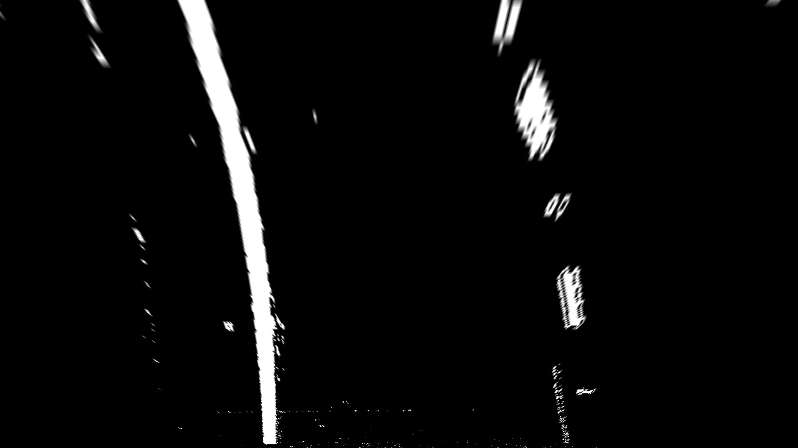

## Advanced Lane Finding
[](http://www.udacity.com/drive)

The Project
---

The goals / steps of this project are the following:

* Compute the camera calibration matrix and distortion coefficients given a set of chessboard images.
* Apply a distortion correction to raw images.
* Use color transforms, gradients, etc., to create a thresholded binary image.
* Apply a perspective transform to rectify binary image ("birds-eye view").
* Detect lane pixels and fit to find the lane boundary.
* Determine the curvature of the lane and vehicle position with respect to center.
* Warp the detected lane boundaries back onto the original image.
* Output visual display of the lane boundaries and numerical estimation of lane curvature and vehicle position.

Output images of the substeps can be found in 

- [output01_undistorted_imgs](output01_undistorted_imgs)
- [output02_binary_imgs](output02_binary_imgs)
- [output03_warped_imgs](output03_warped_imgs)
- [output04_fitted_imgs](output04_fitted_imgs)

Final output images and videos are in

- [output_images](output_images)
- [test_videos_output](test_videos_output)


## Camera Calibration

To calibrate the camera, I used the given photos of the chessboard paper. 

- Making use of the fact that the chessboard has straight squares, we can define object points in a square grid. 
- We use OpenCV's functions `findChessboardCorners` to identify corners in the photos as image points. 
- We then make use of OpenCV's `calibrateCamera` function and use the object and image points. The function returns matrices needed to undistorted images.
- With these matrices, we can undistort images with OpenCV's `undistort` function

Original:


Undistorted:


## Further Preparation

Other than the camera calibration matrix, we also need the transformation matrix necessary to get from the view-on-top-of-car to eagle-eye-view. To do this, we use the test images with straight lanes that were given.

- We apply the processing pipeline of P1 to identify straight lanes:
  - grayscale, gaussian, canny, crop, hough lines, extrapolate lines
- Using the extrapolates lanes, we identify four points (start and end of left and right lane)
- We choose four destination points that are shaped in a rectangle
- We use OpenCV's function `getPerspectiveTransform` to get the transformation matrix `M`


## Pipeline Overview

When we have the `camera calibration` and the `perspective transformation matrix`, we can run a pipeline as follows:

```python
# Pseudo Code
img_undistorted = cv2.undistort(img, mtx, dist, None, mtx)
img_binary = make_binary(img_undistorted)
img_cropped = crop_to_roi(img_binary)
img_warped = cv2.warpPerspective(img_cropped, M, img_size)
img_fitted = fit_polynomial(img_warped_gray, prev[-1])
desc = get_description_text(img_fitted.fitting)
img_annotated = warp_back(img_fitted)
```

- First we _undistort_ the image. Given the preparation work of finding the necessary matrices, this step is a single call of an OpenCV function
- Create a _binary_ representation that helps to identify edges and lanes more easily
- _Crop to the region_ in the image that is relevant for lane detection (the lower half within a trapezoid)
- _Warp to an eagle-eye-view_ using the `perspective transformation matrix`
- _Fit a polynomial curve_ that represents the lanes.
- The last two steps are _computing meta information_ such as curvature and center offset and _annotate_ the image and warp it back


## In Detail: Thresholded Binary Image

As studied in class, I used a sobel filter on the x axis on the lightness `l_channel` in a HLS color space. 

Additionally, I added two masks using OpenCV's `inRange` to identify yellow and white regions in the image, hoping to detect lane lines.

```python
# Pseudo Code
yellow_mask = cv2.inRange(hls, np.array([15,40,70]), np.array([25,255,255]))
white_mask = cv2.inRange(hls, np.array([0,200,0]), np.array([255,255,255]))
[...]
binary[(sxbinary > 0) | (s_binary > 0) | (yellow_mask > 0) | (white_mask > 0)] = 255

```

_Example:_


More here: [output02_binary_imgs](output02_binary_imgs)

## In Detail: Warp Perspective

There is not much to tell here. More interesting is how to compute a suitable perspective transformation which was explained in the section `Further Preparation`. Knowing the transformation matrix `M`, we can transform images with `warpPerspective`

_Example:/Code/udacity_carnd/CarND-Advanced-Lane-Lines/output03_warped_imgs/test6.jpg)_

More here: [output03_warped_imgs](output03_warped_imgs)

## In Detail: Identifying lane-line pixels and fit with polynomial

To identify lane-line pixels, the pipeline uses mostly the same approach with windows as we learnt in class: 

- setting a window size, we mark hot pixels within the window as a lane-line pixel
- we start at a position where the histogram is strong
- We recenter the window in the next iteration if most pixels are to the left/right of the window

My adjustments:

- starting window:
  - Knowing, that the lanes must start rougly where we warped them too, I did not start at the positions where the histogram was strong on the left/right side of the image but picked a smaller region
  - The part in the image where I _highly_ suspect the lane to be, I made the pixels more important than others by doubling their values in the histogram

- recentering:

  - When recentering, I did not recenter to the mean of the hot pixels, but changed direction a bit stronger and also took into account how much i moved in which direction in the iteration before that:

```
recenter_step = int(1.5*x_diff + 0.5*old_x_diff)
```

  - I also did _not_ renceter if the recentering would jump to a totally different location or if the direction would change

- I also stopped searching if I haven't found any pixels in the last few iterations


_Example:_ 

/Code/udacity_carnd/CarND-Advanced-Lane-Lines/output04_fitted_imgs/test6.jpg)

More here [output04_fitted_imgs](output04_fitted_imgs)


### Using previous fittings

When running the pipeline on a video, I save the last curve fitting to apply the lane-line pixel finding method introduced in class by searching around a margin of the given fitting.

So in case the pipeline runs a video, for every frame I

- find a fitting as described with the window method
- find a fitting by searching pixels around the last fitting
- look at how parallel the lanes are and derive a confidence value from that
- choose the fitting with a higher confidence


## In Detail: Compute curvature and position on lane

I used the function as given in class to compute the curvature:

```python
# PARAMS TAKEN FROM CLASS
ym_per_pix = 30/720 # meters per pixel in y dimension
xm_per_pix = 3.7/700 # meters per pixel in x dimension

# Calculate the radius of curvature in pixels for both lane lines
left_curverad, right_curverad = measure_curvature_pixels(ploty, left_fit_cr, right_fit_cr)
rad_curv = 'Radius of Curvature ' + str(round((left_curverad+right_curverad)/2, 3)) + 'm'
```

To compute whether the car is in the middle of the line, I look at the x values of the pixels derived from the curve fitting at the very bottom of the image to see where the lanes are in the image:

```python
middle_of_lane = right_fitx[-1]-left_fitx[-1]
```

Depending on how far the middle of the lane differs from the middle of the image, I know whether the car is on the left or right.


_Example_:


More here [output_images](output_images)

## Videos

<video width="960" height="540" controls>
  <source src="test_videos_output/project_video.mp4">
</video>

<video width="960" height="540" controls>
  <source src="test_videos_output/challenge_video.mp4">
</video>

More videos here: [test_videos_output](test_videos_output)


## What could be better in this pipeline

- There is no smoothing from one frame to another. So lanes can potentially flicker a lot.
- I am also not checking the difference of the detected lane from one frame to another. Depending on the difference, I could gain a `diff_to_prev_frame_confidence`
- I am not checking how sensible a lane is. Depending on such values, I could gain confidence in a fitting. This could be done with:
  - Checking the lane width (is it similar to average lane widths?)
  - Are both lane lines curving to the same direction (if one is facing right, the other left, throw the fitting away. If the fitting curves cross, throw the fitting away)
  - Do lanes start and end at sensible locations?
- Using all these confidence values, it might be possible to disregard / improve a curve fitting. 
  - if one of the lane lines (either right or left) has low confidence, try to find a fitting that is more parallel to the other and see if there are suitable hot pixels that support that fitting
- A step further, using these values, it might be able to classify the binary pixels in the warped images as more or less valuable
- The `challenge_video` showed that different coal tars in the street are easily misinterpreted as lane-lines. Maybe there's a preprocessing edge detection that can identify white/bright lines but not black ones? Or maybe it is possible to lower the contrast of darker gray areas such that the edge filter does not detect these anymore